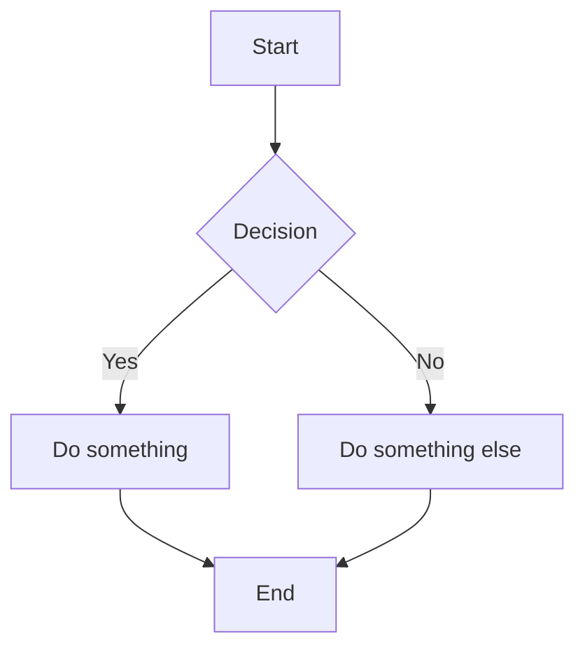

# Redmine Wiki Mermaid

A Redmine plugin that renders [Mermaid](https://mermaid.js.org/) diagrams in wiki pages and provides a live split-pane editor.

## Features

- **Display Mode** — Automatically renders ```` ```mermaid ```` fenced code blocks as SVG diagrams on wiki pages
- **Live Editor** — Split-pane modal editor with real-time preview, accessible from the wiki toolbar
- **8 Templates** — Flowchart, Sequence, Class, ER, Gantt, Mindmap, State, and Pie Chart
- **Edit Existing** — Click the toolbar button while your cursor is inside a mermaid block to edit it
- **Copy & Fullscreen** — Hover actions on rendered diagrams
- **Dark Mode** — Automatically detects Redmine theme and adjusts diagram styling
- **Error Handling** — Invalid syntax shows a friendly inline error message
- **Responsive** — Diagrams scale to fit container width
- **No Dependencies** — Vanilla JS, no jQuery required. Mermaid.js is vendored.

## Requirements

- Redmine 5.0 or higher
- CommonMark formatting enabled (for fenced code blocks)

## Installation

1. Clone or copy this plugin into your Redmine plugins directory:

   ```bash
   cd /path/to/redmine/plugins
   git clone https://github.com/nicenemo/redmine_wiki_mermaid.git
   ```

2. Restart Redmine:

   ```bash
   # If using Puma
   bundle exec rails server

   # If using Passenger
   touch tmp/restart.txt
   ```

3. No database migration is needed — this is a pure frontend plugin.

4. Verify installation at **Administration > Plugins**. You should see "Redmine Wiki Mermaid" listed.

## Usage

### Writing Mermaid Diagrams

In any wiki page, use a fenced code block with the `mermaid` language identifier:

````markdown

````

### Using the Visual Editor

1. Edit a wiki page
2. Click the **📊** button in the wiki toolbar
3. Select a template or write your own Mermaid code
4. The right pane shows a live preview as you type
5. Click **Insert** to add the diagram to your page

### Editing an Existing Diagram

1. Place your cursor inside an existing ```` ```mermaid ```` block in the wiki editor
2. Click the **📊** toolbar button
3. The modal opens pre-populated with the existing diagram code
4. Edit and click **Insert** to update

## Supported Diagram Types

All Mermaid diagram types are supported, including:

- Flowchart / Graph
- Sequence Diagram
- Class Diagram
- State Diagram
- Entity Relationship Diagram
- Gantt Chart
- Pie Chart
- Mindmap
- Timeline
- And more — see [Mermaid documentation](https://mermaid.js.org/intro/)

## File Structure

```
redmine_wiki_mermaid/
├── init.rb                              # Plugin registration
├── assets/
│   ├── javascripts/
│   │   ├── mermaid.min.js               # Vendored Mermaid.js library
│   │   └── wiki_mermaid.js              # Display + editor logic
│   └── stylesheets/
│       └── wiki_mermaid.css             # Styles for diagrams + modal
├── lib/
│   └── redmine_wiki_mermaid/
│       └── hooks.rb                     # View hooks for asset injection
├── config/
│   └── locales/
│       ├── en.yml                       # English translations
│       └── hr.yml                       # Croatian translations
├── LICENSE                              # MIT license
└── README.md                            # This file
```

## License

MIT License. Copyright (c) 2025 Web Solutions Ltd ([ws.agency](https://ws.agency)).

See [LICENSE](LICENSE) for details.
